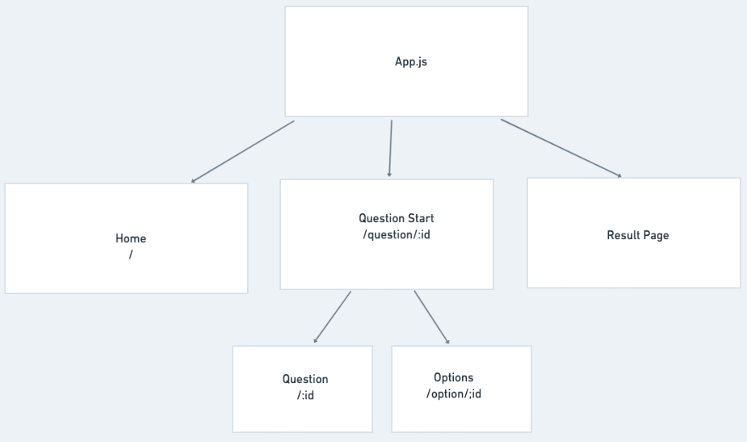

# what's your spirit animal

A game where you'll discover what animal you resemble to the most. The answers to each questions will determine your results. The start button will lead you to the first question while the next button in each question will lead to the next questions and results. The results page will show you a bar graph that will calculate how many people have gotten each animal. The results page will also lead back to the home page.

## API and Data Sample

### https://airtable.com/appPmER2y90LOhWkL/tbl3z39YjSrEDjo6t/viwn00wToZavf7zjf?blocks=hide

    {
      "records": [
        {
            "id": "recSl0UmqtRqY2imE",
            "fields": {
                "results": "0",
                "animals": "bear"
            },
            "createdTime": "2021-09-16T21:14:32.000Z"
        },
        {
            "id": "recV9PMtnPBIaQlMs",
            "fields": {
                "results": "0",
                "animals": "cat"
            },
            "createdTime": "2021-09-16T21:14:39.000Z"
        },
        {
            "id": "recGE8AKasrAKztq4",
            "fields": {
                "results": "0",
                "animals": "crab"
            },
            "createdTime": "2021-09-16T21:14:39.000Z"
        }
    ],
    }

## Wireframes

## Component Hierarchy

## MVP

-Responsive design
-Linked pages
-Functional results
-Linked and working buttons

## Post MVP

-Adding a star rating

## Project Schedule

| Day             | Deliverable                                            | Status     |
| --------------- | ------------------------------------------------------ | ---------- |
| September 16    | Wireframes /Airtable /Project Approval                 | Complete   |
| September 17    | GET/POST Data/ Creating components/ Linking components | Incomplete |
| September 18-19 | Working in components                                  | Inomplete  |
| September 20    | Initial Clickable Model/ Components/ MVP               | Inomplete  |
| September 21    | CSS & MVP                                              | Incomplete |
| September 22-23 | More MVP/ More Styling                                 | Incomplete |
| September 24    | Presentations                                          | Incomplete |

## Timeframes

| Component              | Priority | Estimated Time | Time Invested | Actual Time |
| ---------------------- | :------: | :------------: | :-----------: | :---------: |
|                        |          |                |               |             |
| Home Page              |    H     |      4hrs      |      hrs      |     hrs     |
| Start Button           |    H     |      4hrs      |      hrs      |     hrs     |
| Question 1 Component   |    H     |      3hrs      |      hrs      |     hrs     |
| Question 2 Component   |    H     |      3hrs      |      hrs      |     hrs     |
| Question 3 Component   |    H     |      3hrs      |      hrs      |     hrs     |
| Question 4 Component   |    H     |      3hrs      |      hrs      |     hrs     |
| Description Component  |    H     |      5hrs      |      hrs      |     hrs     |
| Results Component      |    H     |      5hrs      |      hrs      |     hrs     |
| View Results Component |    H     |      3hrs      |      hrs      |     hrs     |
| Next Buttons           |    H     |      5hrs      |      hrs      |     hrs     |
| Finish Button          |    H     |      3hrs      |      hrs      |     hrs     |
| CSS                    |    H     |      3hrs      |      hrs      |     hrs     |
| Media Query            |    H     |      3hrs      |      hrs      |     hrs     |
| Total                  |    H     |     47hrs      |      hrs      |     hrs     |

## SWOT Analysis
